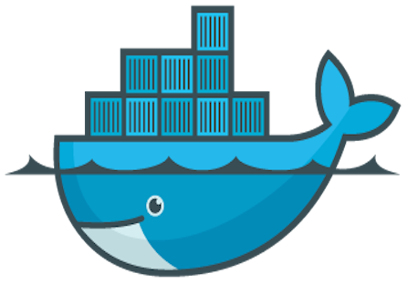
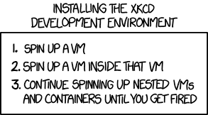

<!-- .slide: data-background="./images/drupalcampla-presentation-template-1024x768.png" -->
## Drupal Development with Docker

Casey Grzecka
#### UCLA Library

---

<!-- .slide: data-background="./images/drupalcampla-presentation-template-1024x768.png" -->
### My Local Dev Docker Arc
1. look for existing tool (drude)
2. roll my own (z3cka/c9-phpbrew-drupal)
3. look again and discover (Docksal)

Note:
### purpose of this talk
1. question feasability and value (tell brief Drude story) - https://github.com/blinkreaction/dde
2. feel the pain
3. joy of not reinventing the wheel
4. show and learn about a really great tool

---

<!-- .slide: data-background="./images/drupalcampla-presentation-template-1024x768.png" -->
# Docker

Note:
* Basic background
* good for deployment

<!--v-->

<!-- .slide: data-background="./images/drupalcampla-presentation-template-1024x768.png" -->
## Why local Docker
<ul>
  <li class="fragment">VM vs container</li>
  <li class="fragment">better resource utilization</li>
  <li class="fragment">dependency isolation</li>
  <li class="fragment">separation of concerns</li>
</ul>

Note: 
* VM vs container
* better resource utilization
* dependency isolation
* separation on concerns

---

<!-- .slide: data-background="./images/drupalcampla-presentation-template-1024x768.png" -->
#### Why Roll your own local Docker Dev
<ul>
    <li class="fragment">my vagrant local Host mounted fs via virtualbox was sooooo slow</li>
    <li class="fragment">mimic arch that we will be deploying to</li>
    <li class="fragment">multiple projects with diff deps</li>
    <li class="fragment">docker was so new and shiny</li>
    <li class="fragment">I don't like (manually configuring) VMs</li>
    <li class="fragment">docker native in linux</li>
</ul>

Note:
* What does it take? My experience rolling my own.  
* fixed mount by nfs4 maybe

---

<!-- .slide: data-background="./images/drupalcampla-presentation-template-1024x768.png" -->
#### When Rolling your own local Docker Dev
* Don't treat you container like a VM
<ul>
    <li class="fragment">unless you want to</li>
    <li class="fragment">do what you want</li>
</ul>

    `docker run -it ubuntu bash`

<ul>
    <li class="fragment">and you are off</li>
    
`apt get install vim foo`

</ul>

Note:
* I'm not your mom
* that's how I started

---

<!-- .slide: data-background="./images/drupalcampla-presentation-template-1024x768.png" -->
### Doing the Old Way, the New Way
* you need ports open, services started, volumes mounted, etc.
* so, let's just re-run with new configs, wrong, can't data does not persist without volume mounted, host or otherwise
* so, build the repetitive tasks into a Dockerfile...
* so easy, basically bash
* and make each image inherit only what it needs...
* show z3cka/c9 + php + drupal 
    * where do we install and run MySQL?

Note:
2. you could docker export or commit or something, but don't
 
* are you feeling the pain?
* does this seem better?

<!--v-->

<!-- .slide: data-background="./images/drupalcampla-presentation-template-1024x768.png" -->
#### Can we start coding drupal awesomeness yet? 

No!!!! We have more local arch to manage!

<!--v-->

<!-- .slide: data-background="./images/drupalcampla-presentation-template-1024x768.png" -->
## Separate concerns
* Put services in different containers
* do the next iteration of clown computing just with containers
* use docker-compose
    * yaml that sets up all your services

<!--v-->

<!-- .slide: data-background="./images/drupalcampla-presentation-template-1024x768.png" -->

>Docker is awesome, and fun to play with!  —Me

<!--v-->

<!-- .slide: data-background="./images/drupalcampla-presentation-template-1024x768.png" -->
### but...

## XKCDE
> `4. They unplug the root machine but the thousands of leaf VMs scatter in the wind and start spinning up new instances wherever they land

<!--v-->

<!-- .slide: data-background="./images/drupalcampla-presentation-template-1024x768.png" -->
#### Wouldn't it be nice if you didnt have to start from scratch?
* everything in the lamp stack has been dockerized already
* use a tool
* what if I told you this tool would manage your VM too!?

---

<!-- .slide: data-background="./images/drupalcampla-presentation-template-1024x768.png" -->
## Introducing Docksal
  
`Dock---s-----al`  
`Docker s Drupal`

Note:
* Say generally what it does

<!--v-->

<!-- .slide: data-background="./images/drupalcampla-presentation-template-1024x768.png" -->
>Maybe the 's' is from the 's' in dorsal; as in the dorsal fin of the Docker whale.  
—S. Gurnick

<!--v-->

<!-- .slide: data-background="./images/drupalcampla-presentation-template-1024x768.png" -->

## What is Docksal?
  

Note:
Docksal is a tool for defining and managing development environments. It brings together common tools, minimizes configuration, and ensures environment consistency throughout your continuous integration workflow.

<!--v-->

<!-- .slide: data-background="./images/drupalcampla-presentation-template-1024x768.png" -->
## Features

`fin`   
  
FTW!

Note:
Docksal uses Docker to create fully containerized environments. It also uses Virtual Box to support MacOS and Windows. Its main feature is the inclusion of a command-line tool, called fin, that simplifies the management of all components.

<!--v-->

<!-- .slide: data-background="./images/drupalcampla-presentation-template-1024x768.png" -->
## Toolbox

Docksal comes preloaded with common Drupal development tools like:
* Drush 
* Drupal Console
* Composer
* PHP Code Sniffer
* php-cli
* It also comes with node, npm, ruby, bundler, and python.

<!--v-->

<!-- .slide: data-background="./images/drupalcampla-presentation-template-1024x768.png" -->
## Services
### Built-in support for 
* Apache Solr 
* Varnish 
* Memcache 
* Selenium
* Behat. 
 
And since services are containerized with Docker, any other service needed for a project can be added!

---

<!-- .slide: data-background="./images/drupalcampla-presentation-template-1024x768.png" -->
## Docksal VM management
* Docker still needs a VM to run on OS X* _le sigh_
Commands
    * `fin start`/`stop`/`kill`
    * `fin ram` – show and set memory of the vm
    * `fin hdd` – Show disk size and usage
    * `fin stats` – Show CPU and network usage

Note:
* technically the "native" Mac OS is still a small vm called xyve (or something like that)

---

<!-- .slide: data-background="./images/drupalcampla-presentation-template-1024x768.png" -->
## Docksal Project handling

* `fin pl` — project list
* `fin project create` demo in a bit
* existing project support _(will show this as well)_

---

<!-- .slide: data-background="./images/drupalcampla-presentation-template-1024x768.png" -->
## Docksal envronment
* Env file
    * set docroot
    * enable xdebug

---

<!-- .slide: data-background="./images/drupalcampla-presentation-template-1024x768.png" -->
## Docksal Servies – yaml
Define services via docker-compose with images, etc.
* apache/php version via docker images: 
    * `docksal/web:1.0-apache2.2`
    * `docksal/cli:1.2-php7`
* add solr to drupal – _UCLA Library demo_

---

<!-- .slide: data-background="./images/drupalcampla-presentation-template-1024x768.png" -->
Docksal cli: fin
`fin db`
    Examples:

    fin db dump ~/dump.sql            #Export!
    fin db import ~/dump.sql          #Import!

---

<!-- .slide: data-background="./images/drupalcampla-presentation-template-1024x768.png" -->
## Docksal share!!!
    fin share
### Built in https://ngrok.io/

---

<!-- .slide: data-background="./images/drupalcampla-presentation-template-1024x768.png" -->
Try anything! (Almost)
* Git gogs server + droneCI
* get crazy with anything you can run with Docker

---

